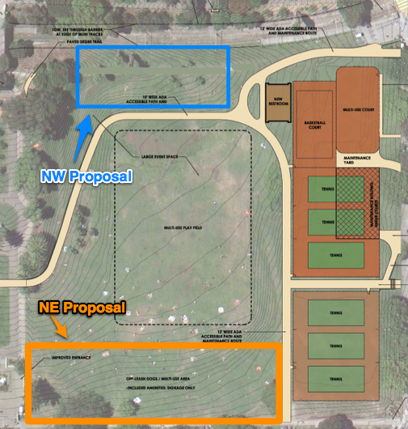

# Proposal: Alternate North Field Dog Area

Author: Alex Chaffee
<alex@stinky.com>
<http://alexchaffee.com>

# Preamble

The park is home to a diverse set of users.

These rules must provide for minimizing conflict between people doing different things at the same time.

An important question is, would these rules work assuming no official enforcement?

When we talk about an official dog area, we're talking about three things:

  * signs
  * amenities
  * convention

The convention -- the idea that people will use it because other people use it -- is arguably the most important factor. If nobody uses it, then what's the point? "If we build it wrong, they won't come."

Think of these areas not as boundaries, but as foci -- points of attraction for certain activities. It makes no sense to put foci for two incompatible activities in the same spot. That's an inevitable recipe for conflict between two otherwise harmonious uses of the park.

# Guiding principles in planning dog areas

* bigger is better
  * more exercise, more varied dog play
  * less conflict between dogs
  * less conflict with other park users at the boundaries
  * less wear (if you spread play out, it rarely gets down to the dirt)

* more is better (i.e. more, separated dog play areas)
  * all of the above, plus
  * if two dogs are enemies, you can bring one to the other area
  * if someone drops a party or a show in the middle of one area, all can move - it sends a message that dogs are welcome in the park

* amenities are essential
  * we need benches, drinking fountain, trash cans, bag dispenser,
etc. in each area
  * otherwise people will not use them, and so what's the point of declaring them?

* The current free-for-all system works pretty well
  * Currently roughly 80% of the lawn space in Dolores Park is effectively off-leash.
    * The area bordering 20th St., near the playground, is by social convention leash-only, and when large picnicking crowds gather, the dog owners usually gravitate away.
  * Most conflicts I've seen have been between two dog owners; when a dog has bothered a human, the owner has been polite and got the dog out of there and the conflict was resolved amicably. But when two dog owners start yelling at each other, or a non-dog-owner feels threatened, that can escalate into a real aggressive conflict.
  * Therefore it's essential that when a conflict arises, there is somewhere for the dog owner to go to.

# Official Proposal: Hipster Hill

  * [todo: description]

## pros
  * somewhat flat (though if you look at the map, the demarcated area is sloped)
  * close to park entrance

## con

* It's on a slope, so most dog play would occur uphill (W) on the flat part anyway, where it does now most mornings and early afternoons
* It's close to Dolores Ave. near 18th, which is actually the main entrance to the park, allowing incursions by picnickers, sunbathers, vendors, and transients, many of whom have their own dogs with them, and all of whom are unwelcome distractions to playing dogs, and usually vice versa.
* It's close to a busy street, so unless we put a fence at the sidewalk, many dog owners won't feel comfortable using it with skittish dogs.
* It's on a slope, so on rainy days, wear would greatly increase, and/or it'd be too slippery to use.

The biggest problem with that area is that it's already claimed by the hipsters! If we come out with plans that have paths or benches or boulders or dog fountains or even signs smack in the middle of the most trafficked, most used part of the park, then the conversation will immediately turn into a loud, public fight pitting dog owners against hipsters (with onlookers cheering and jeering at all parties).

*Possibility for conflict:* **HIGH**

# Alternate Proposal: Northwest Slope

  * description
  * pro
  * close to ADA path
  * some trees -> shade
  * close to Southwest Slope Area (but not too close!)
  * con
  * mostly hilly
  * existing path
  * smaller area

*Possibility for conflict:* **LOW**

## Paths

I propose we remove a section of the current sidewalk path (going from the Muni stop up the hill to the steps just north of the bridge). This will compensate for the addition of a 10' wide path right nearby by regaining green lawn.

The removal of the straight path will improve traffic through the park by encouraging strollers to meander along the ADA path.

If people want to walk, or jog, in a straight line along that side of the park, then they can hop across the bridge and walk along the path on the far side of the tracks. This area is being improved anyway; let's encourage people to use it.

## Amenities

Benches are very important for a dog area, and the current SW dog area points out (a) how well-used they are, and (b) how poorly placed benches can make a dog area worse. The benches are too close together, causing concentrated wear on the ground around the benches, and they face the wrong direction, forcing owners to crane their necks, and encouraging play on the uphill

A NW dog area should have benches facing the lawn and hill down to the soccer field. These benches would be appreciated and used by non-dog-owners too, just like the benches currently lining the path above the SW dog area.

Also, any dog area worth the name should have a fountain, both for dogs to drink and for owners to wash their dirty pets before leaving.

It is impossible to imagine putting benches or fountains in the middle of hipster hill. Even if a fountain is placed outside the tennis court, it would be inconvenient for dogs to use, and tennis players would likely not appreciate sharing a fountain with muddy slobbering dogs (another potential source of conflict).

## Fences

The NW dog area depends on a reliable fence between the muni tracks and the park. This is mandated by safety concerns anyway.

The ADA path will be downhill of the NW dog area, providing a natural boundary, as well as a retaining wall. It's not clear to me that any more fencing would be necessary or desirable between the hill and the path.

# Maps and photos

  * Hipster Hill on a nice day
  * Northwest Slope

## Proposed NW Dog Area

As an aside, I find it deeply amusing that the aerial map used to demonstrate the NE dog area shows several dozen picnic blankets laid out right inside the boundary, presumably occupied by sunbathers and couples who would not appreciate a dog playing fetch on top of them.

# FAQ (straw man / devil's advocate)

## Why are you claiming both western hillsides?

1. we're not claiming anything; we're providing a place where dog owners can retire to avoid conflicts with other park users, but most of the time the area would be open, relatively dog-free, and multi-use
2. there are many other hillsides in the park, including one right nearby (see map) with an even better view of downtown and the event field

## Isn't this a land grab by the dog people?

No; if you check the maps you'll see that the area allowing off-leash dogs on the north field is significantly reduced.

[find current RPD dog map too]

## Isn't the hill too hilly?

Maybe. But it's not much steeper than Hipster Hill. And the ADA path will require a retaining wall above it, which will level it out some. It's also possible to regrade it slightly while retaining its character.

