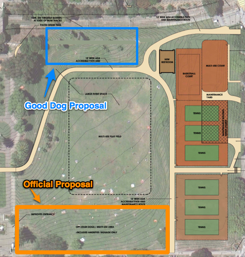

# Proposal: Good Dog Area

## Author: Alex Chaffee
* twitter: [@alexch](http://twitter.com/alexch)
* email: <alex@stinky.com>
* web: <http://alexchaffee.com>
* This document: <http://alexchaffee.com/dolores/dogarea.html>

Come to the [next open workshop this Thursday](http://sfrpd.org/wp-dev/?p=3621) and let them know what *you* think. (Even if you disagree with me!)

# Abstract

This Thursday is the second-to-last open public workshop on the Dolores Park
Renovation project. The process has produced a pretty good plan, under some
serious constraints, and the dog subcommittee especially has done a great job.
But there's one decision that I think is really dumb, and unless more people
show up and say so too, it will go forward. Namely:

The current Dolores Park plan has an off-leash area in the North-East corner of the park, **directly covering Hipster Hill**. This is arguably the worst possible place to have a dog area. Instead, we should put a dog area along the North-West edge, which would be safer, easier to maintain, and less likely to lead to conflicts.

(Note that there's also an official proposal for a dog area in the South Field. I think that's a great plan and I support it wholeheartedly. This document is just about dog areas in the *NORTH* field.)

# Preamble

The park is home to a diverse set of users.

We have an opportunity here, with the DP Renovation, to improve Dolores Park for everyone, dog owners and picknickers and kids and atheletes and sunbathers and tourists and all. But we also have a risk -- if we make the wrong choices, we will make the park less fun for everybody.

What is a dog area? Basically it's two things:

  * signs and other signals (e.g. natural boundaries and word of mouth) for letting people know, in general, where dogs are invited to play
  * amenities for dog owners, to help them supervise their dogs at play

So try to think of a dog area not as a boundary, but as a focus -- a point of attraction for a certain group of park users.

It makes no sense to put foci for two incompatible activities in the same spot. That's an inevitable recipe for conflict between two otherwise harmonious uses of the park. But sadly, the current north field dog area plan does just that.

# What makes a good dog area?

* Bigger is better
  * more exercise, more varied dog play
  * less conflict between dogs
  * less conflict with other park users at the boundaries
  * less wear (if you spread play out, it rarely gets down to the dirt)

* Separation, not segregation
  * If there are more, separated dog play areas, then...
  * If two dogs are enemies, you can bring one to the other area
  * If someone drops a party or a show in the middle of one area, all dogs can move to the other area

* Amenities are essential
  * benches, drinking fountain, trash cans, poop bag dispensers, shade trees,
etc. in each area
  * with amenities, dog owners will gravitate to these areas; without amenities, a dog area is just a line on a map nobody reads

# Current Official Proposal: Hipster Hill

## pro

  * somewhat flat, though quite steep on one side
  * close to Dolores & 18th entrance
  * separated from field

## con

* Safety-conscious dog owners will put their dogs on leash when they are near a busy street. But Hipster Hill is **next to a busy street**. Why would we put an off-leash dog area in an area where dogs are frequently leashed?  (The sad logical outcome of this would be to put a fence at the sidewalk, which I think nobody wants.)
* It's very close to Dolores St. near 18th, which is actually the main entrance to the park, allowing incursions by picnickers, sunbathers, vendors, and transients, many of whom have their own dogs with them, and all of whom are unwelcome distractions to playing dogs, and usually vice versa.
* Dog owners want their dogs to play, not to beg. But Hipster Hill is **full of sandwiches**. That leads to begging dogs and nervous lunchers.
* It's on a slope, which increases wear and tear on the lawn, especially on soggy days.
* It's on a slope, so most dog play would occur uphill (W) on the flat part anyway, where it does now most mornings and early afternoons.

Finally, the biggest problem with that area is that it's already claimed by the hipsters! If we come out with plans that have paths or benches or boulders or dog fountains or even signs smack in the middle of the most trafficked, most used part of the park, then the conversation will immediately turn into a loud, public fight pitting dog owners against hipsters (with onlookers cheering and jeering at all parties).

> *Possibility for conflict:* **HIGH**

# Alternate "Good Dog Area" Proposal: Northwest Slope

## pro
  * close to Church & 18th entrance
  * close to ADA path, making it accessible
  * some trees -> shade
  * close to Southwest Dog Area -- easy to move from one dog area to another

## con
  * more hilly
  * smaller area
  * a paved path currently runs through it
  * next to Muni tracks

> *Possibility for conflict:* **LOW**

# Details

## Paths

I propose we remove a section of the current sidewalk path (going from the Muni stop up the hill to the steps just north of the bridge). This will compensate for the addition of a 10' wide path right nearby by regaining green lawn.

The removal of the straight path will improve traffic through the park by encouraging strollers to meander along the ADA path.

If people want to walk, or jog, in a straight line along that side of the park, then they can hop across the bridge and walk along the path on the far side of the tracks. That path area is being improved anyway; let's encourage people to use it.

## Amenities

Benches are very important for a dog area, and the current SW dog area points out (a) how well-used they are, and (b) how poorly placed benches can make a dog area worse. The benches are too close together, causing concentrated wear on the ground around the benches, and they face the wrong direction, forcing owners to crane their necks to supervise their pets, and forcing them to stand up and walk around if they need to grab them.

A NW dog area should have benches at the rear, facing the lawn and hill down to the soccer field. These benches would be appreciated and used by non-dog-owners too, just like the benches currently lining the path above the SW dog area.

Also, any dog area worth the name should have a fountain, both for dogs to drink and for owners to wash their dirty pets before leaving.

It is horrifying to imagine putting benches or fountains in the middle of Hipster Hill.

More bench design thoughts:

  * dog area benches should *face* where the dogs play, and not be placed in the middle of a lawn
  * benches allow dog owners to chill out and supervise their dogs
  * benches also provide a "safe zone" where dogs can retreat when play gets too rough
  * benches should be spaced out enough that the abuse of the lawn around them is not multiplied

## Fences

A NW dog area will depend on a reliable fence between the muni tracks and the park. This is mandated by safety concerns anyway.

The ADA path will be downhill of the NW dog area, providing a natural boundary, as well as a retaining wall. It's not clear that any more fencing would be necessary or desirable uphill of the path.

# Maps and photos

  * Hipster Hill on a nice day [todo]
  * Northwest Slope [todo]
  * [Framework Plan](http://sfrpd.org/wp-dev/wp-content/uploads/FRAMEWORK-PLAN_med_res.pdf) [pdf]
  * Proposal(s):

(As an aside, I find it amusing that the aerial map used to demonstrate the NE dog area shows several dozen picnic blankets laid out right inside the boundary, presumably occupied by human sunbathers and diners who might not appreciate a pack of dogs running among them.)

# FAQ

## Isn't this a land grab by the dog people?

No; if you check the maps you'll see that the area allowing off-leash dogs on the north field is significantly reduced.

[todo: find current RPD dog map too]

But, even though it is smaller, it is plenty big enough to provide some good ball-tossing and chasing space.

## Why are you claiming both western hillsides?

1. we're not claiming anything; we're providing a place where dog owners can retire to avoid conflicts with other park users, but most of the time the area would be open, relatively dog-free, and multi-use
2. there are many other hillsides in the park, including one just around the bend with an even better view of downtown and the event field
3. if there's an event that brings a lot of people to the north field, dogs can and should move to the south field... and vice versa

## Isn't the hill too hilly for dogs?

Maybe. But it's not much steeper than Hipster Hill. And the ADA path will require a retaining wall above it, which will level it out some. It's also possible to use the renovation machinery to regrade it slightly while retaining its essential bowl-shaped character.

## But what about the hill down to the tracks?

That hill is a complete distaster. It's too steep to use, and if a person or a dog succeeds in walking down it without slipping, they emerge on the dangerous Muni tracks. In my opinion there needs to be a wall lining Muni Canyon, with a serious fence to keep people and animals from falling in. That would allow *more* flat green space in the park proper. And against the fence would be a great place to put some benches facing the field and the downtown skyline.

## Doesn't the NW dog area encroach on the soccer field?

No, it's actually about the same distance from the edge of the flat field, and arguably encroaches *less* since it's separated by some altitude and the ADA path.

## Won't all these dog areas lead to chaos?

Probably not. If you think about it, the current free-for-all system is not ideal, but it works pretty well. For example:

  * Currently roughly 80% of the lawn space in Dolores Park is effectively off-leash today.
  * The area bordering 20th St., near the playground, is by social convention leash-only.
  * When large picnicking crowds gather, the dog owners usually gravitate away.
  * Dog owners don't like it when their dogs beg for sandwiches any more than the sandwich owners do.

Most conflicts I've seen have been between two dog owners; when a dog has bothered a human, the owner has been polite and apologetic and gotten the dog out of there, and the conflict was resolved amicably. But when two dog owners start yelling at each other, or a non-dog-owner feels threatened, that can escalate into a real aggressive conflict. (Not fun!)

  > Therefore it's essential that when a conflict arises, there is a designated space for the dog and owner to go.

## So I can't play fetch on the north field anymore?

I'm not telling anyone what they can't do. I'm sure that people will continue to run their dogs all across the park, in the mornings, and cloudy afternoons, as they do now without harm.

This proposal attempts to predict and react to a park which has been getting more and more users, and to design some practical guidelines for when there *is* a conflict.

# Conclusion

More benches! No fences! More shade trees!

Share the park.

Coexist.

# References

* <http://sfrecpark.org/documents/Workshop1Presentation06.02.11.pdf>
* <http://www.doloresparkworks.org/dolores-park-renovation/>
* <http://sfrecpark.org/doloresParkProject.aspx>
* <http://missionlocal.org/2011/09/wait-dolores-park-is-historical/>
* <http://missionlocal.org/2011/08/dolores-park-renovation-now-weve-got-a-plan/>
* <http://sfrpd.org/wp-dev/wp-content/uploads/FRAMEWORK-PLAN_med_res.pdf>
* <http://sfrpd.org/wp-dev/?p=3541>

